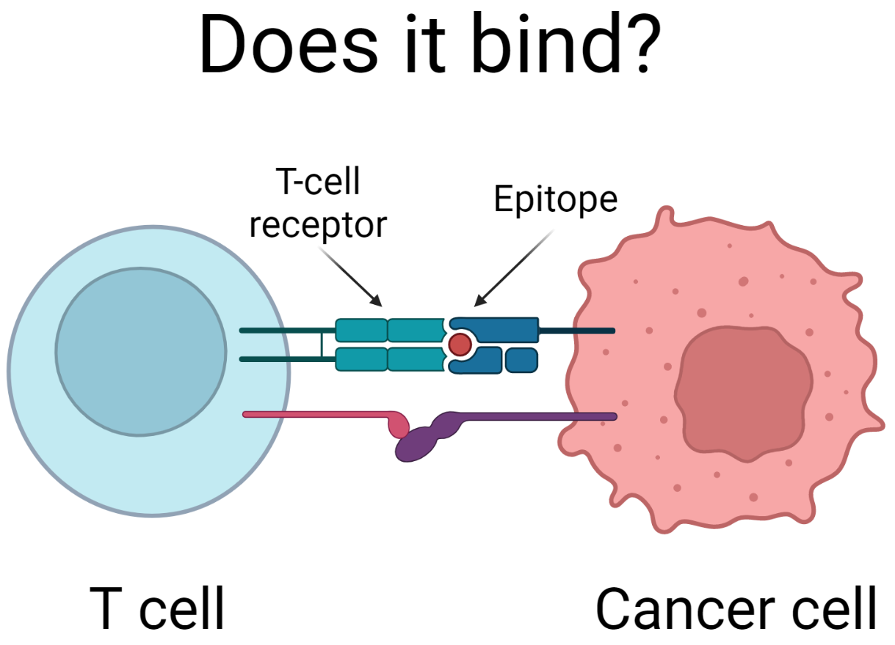
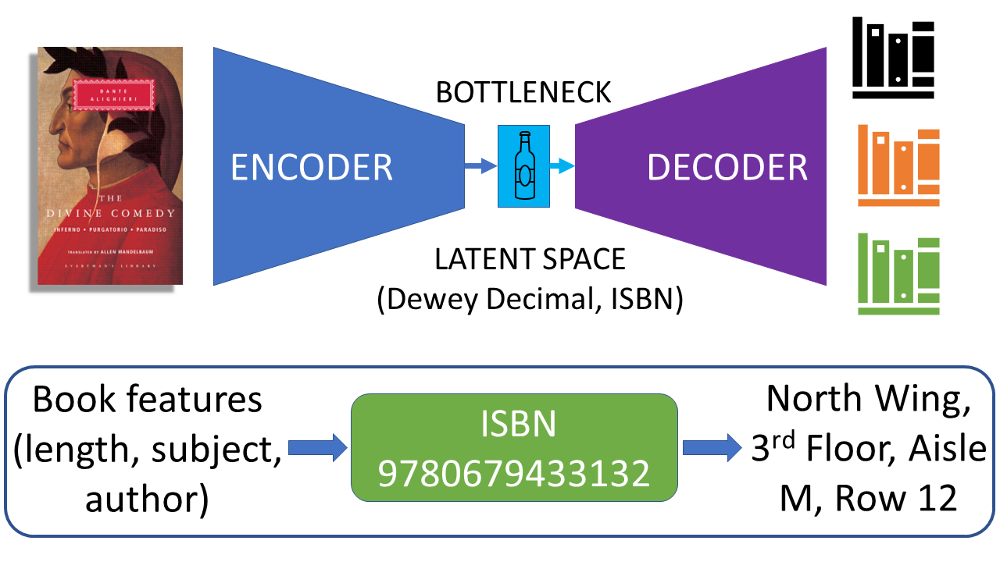

# Bioinformatics model for protein therapeutics

## Synopsis

We'll use the [Therapeutics Data Commons](https://tdcommons.ai/) Python package to download open-source ([CC BY 4.0](https://creativecommons.org/licenses/by/4.0/)) datasets that are meaningful in pharmaceutical research. In this repository, we'll use a dataset called [TCR-Epitope Binding Affinity](https://tdcommons.ai/multi_pred_tasks/tcrepitope/). The code will be in the notebook [notebooks/tdc-tcr-epitope-binding-affinity.ipynb](notebooks/tdc-tcr-epitope-binding-affinity-model.ipynb).



We show how to create a deep learning model for predicting if a T-cell receptor (TCR) and protein epitope will bind to each other. A model that can predict how well a TCR bindings to an epitope can lead to more effective treatments that use immunotherapy. For example, in anti-cancer therapies it is important for the T-cell receptor to bind to the protein marker in the cancer cell so that the T-cell (actually the T-cell's friends in the immune system) can kill the cancer cell.

We'll see how to use the open-sourced [bio-embeddings](https://docs.bioembeddings.com/v0.2.3/) Python library to get the latest state-of-the-art AI model for embedding the protein sequences. In this case, we use Facebook's open-source [Evolutionary Scale Model (ESM-1b)](https://github.com/facebookresearch/esm). These embeddings turn the protein sequences into a vector of 1,280 numbers that the computer can use in a mathematical model. The vector of numbers uniquely encodes (aka embeds) a protein sequence in the same way that the [Dewey Decimal System](https://en.wikipedia.org/wiki/Dewey_Decimal_Classification) and [ISBN](https://en.wikipedia.org/wiki/ISBN) uniquely encode a book into a set of numbers (and letters). This representation is also referred to as a [latent space](https://en.wikipedia.org/wiki/Latent_space#:~:text=A%20latent%20space%2C%20also%20known,another%20in%20the%20latent%20space).

Then, we'll show how to combine this embedding with a simple neural network to create a [binary classifier](https://en.wikipedia.org/wiki/Binary_classification) for the TCR-epitope binding affinity prediction (True=They Bind, False=They don't bind).



## Running things locally
### Creating the `conda` environment

To install all of the required Python packages, you'll need to create a [conda](https://docs.conda.io/en/latest/miniconda.html) environment. Follow the [conda website](https://docs.conda.io/en/latest/miniconda.html) directions to download and install `conda` ([Anaconda](https://www.anaconda.com/products/distribution) works too). Once you have `conda` installed, run the command:

```bash
conda env create -f environment.yml
```

Once the environment is successfully created, activate it by running:

```bash
conda activate tdc-tcr-epitope-binding-affinity-env
```

At this point you should be able to run the Jupyter Notebook:

```bash
jupyter notebook notebooks/tdc-tcr-epitope-binding-affinity-model.ipynb
```

## Running things in a container

If you don't want to install `conda`, then you can run the Jupyter notebook from within a container.

### Apptainer

To create an [Apptainer](https://apptainer.org), run the command:

```bash
apptainer build tdc-tcr-epitope-binding-affinity.sif tdc-tcr-epitope-binding-affinity.def
```

Then, run:

```bash 
apptainer shell tdc-tcr-epitope-binding-affinity.sif
```

At this point, you'll be able to run the Jupyter Notebook:

```bash
jupyter notebook notebooks/tdc-tcr-epitope-binding-affinity-model.ipynb
```

### Docker

To create a [Docker](https://docker.com), run the command:

```bash
docker build -t tdc-tcr-epitope-binding-affinity .
```

Now you can run:

```bash
docker run tdc-tcr-epitope-binding-affinity
```

And finally you can run the Jupyter Notebook:

```bash
jupyter notebook notebooks/tdc-tcr-epitope-binding-affinity-model.ipynb
```
